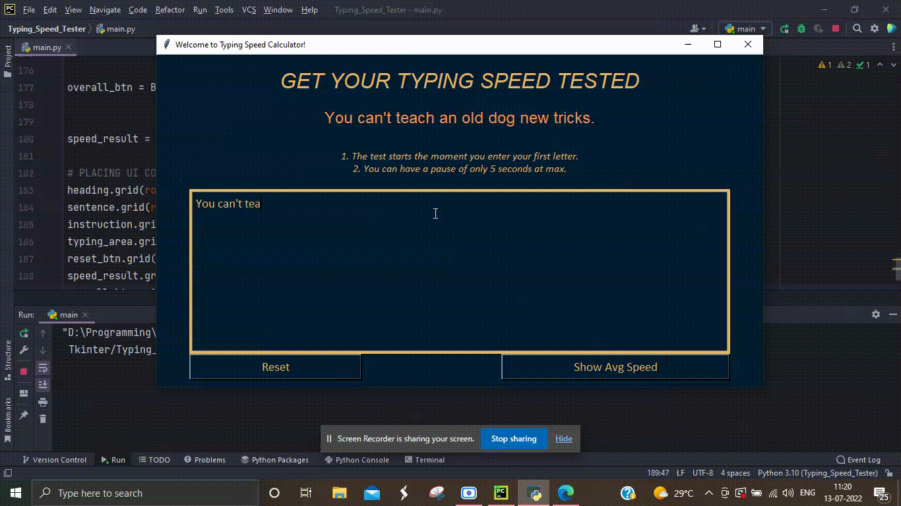

# Typing_Speed_Test
A GUI application written in python to get your typing speed tested.

Type in the sentence shown. Then your speed is shown along with the message, if you did or did not make any errors. Your speed for each sentence keeps getting stored and you can view your overall average speed.

  

<b> <em> Text </em> </b>

<h1> Guide to Build This Project <i>(Work in Progress)</i> </h1>

<h3> Step 1: Setting up the UI  </h3>

  Import tkinter library. Use its <b> <em> Tk() </em> </b> class to create a screen object. Give it a title using <b> <em> title </em> </b> method. 
  Decide on a color pallete to use and store the <b> <em> #hexcodes </em> </b> in constants. Also create some tuples and store them in some constants to give
  our fonts some styling. We need a total of 7 widgets - 2 Buttons (Reset and Show overall average speed), 
  4 Labels (Heading, Sentence that user has to type, Instructions, and Speed result), and 1 Typing Area using Text. 
  We place them on screen using grid layout system.
  The overall speed result is hidden as we want it to be shown only when user has typed something and it is evaluated.
  We give them necessary colors, borders and font styles using our constants.

<h3> Step 2: Setting up Globals  </h3>

  Text

<h3> Step 3: Heading  </h3>

  Text

<h3> Step 4: Heading  </h3>

  Text

